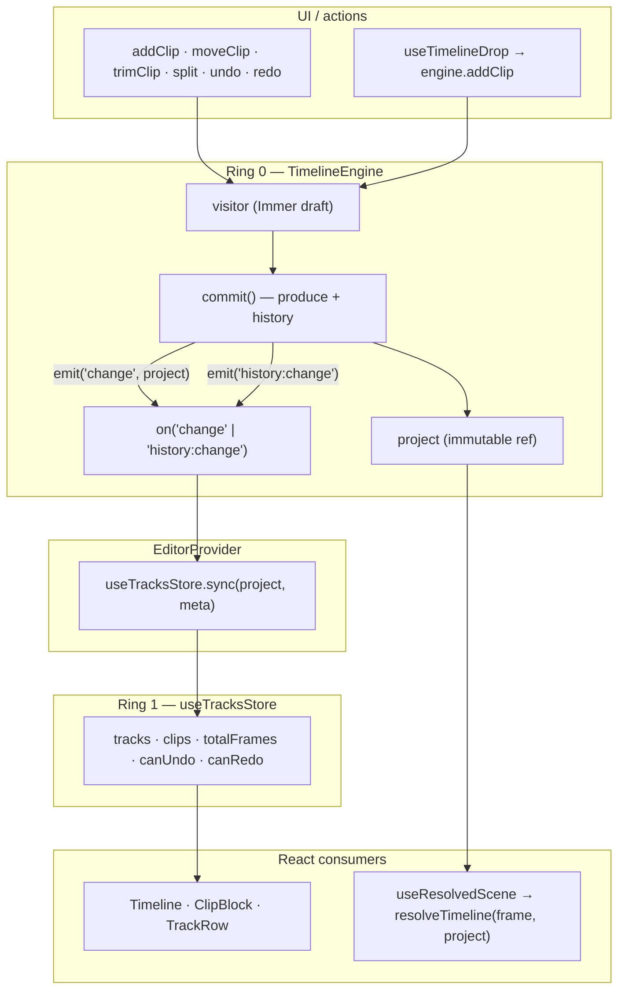
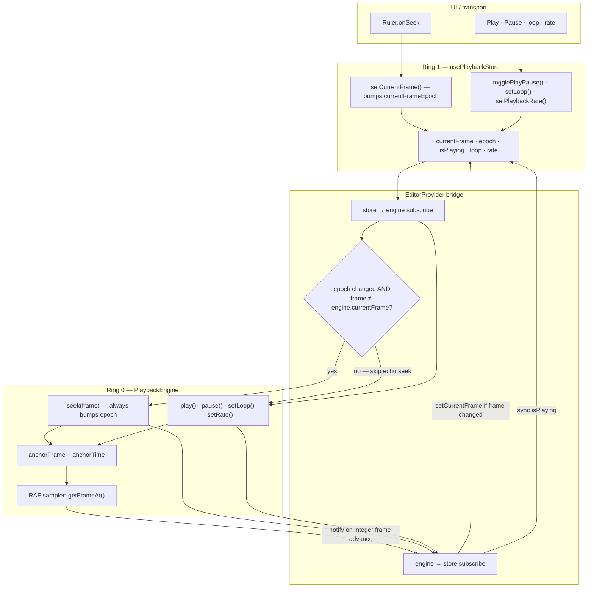
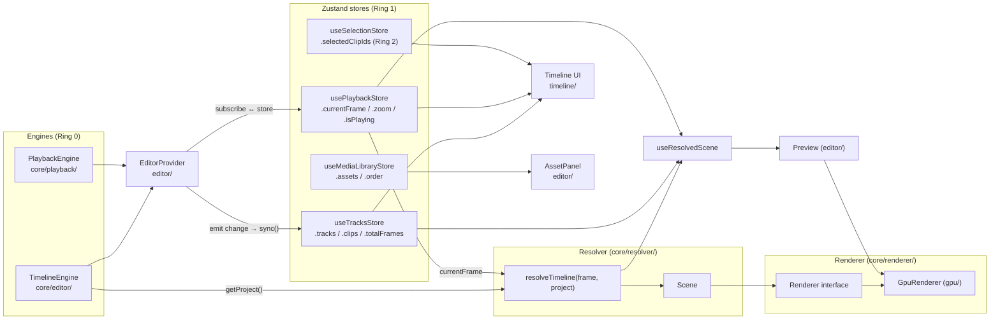

# Architecture

> The design principles, layer boundaries, and data flow of the editor engine. This is the canonical reference; everything else (roadmap, PR backlog) descends from this document.

---

## Table of contents

1. [Design principles](#1-design-principles)
2. [The three-ring state model](#2-the-three-ring-state-model)
3. [Time, frames, and the playback clock](#3-time-frames-and-the-playback-clock)
4. [The data model](#4-the-data-model)
5. [The timeline resolver](#5-the-timeline-resolver)
6. [The render abstraction](#6-the-render-abstraction)
7. [Data flow end-to-end](#7-data-flow-end-to-end)
8. [What lives where (package boundaries)](#8-what-lives-where-package-boundaries)
9. [What this architecture rejects (anti-patterns)](#9-what-this-architecture-rejects-anti-patterns)

---

## 1. Design principles

These principles are **load-bearing**. Every decision in the codebase traces back to one of them.

### P1. Engine first, framework second.

The core of the editor — `TimelineEngine`, `PlaybackEngine`, `resolveTimeline` — has zero React imports. It runs in Node, in a Web Worker, in a CLI, or under WASM. React is a *consumer* of the engine, not its host.

### P2. Time is integer frames.

`currentFrame: number` is the unit. Clips have `startFrame`, `durationFrames`, `sourceStartFrame`, `sourceDurationFrames`. Seconds exist only at the rendering boundary (`videoEl.currentTime = sourceFrame / fps`). This eliminates floating-point drift after splits, trims, and moves.

### P3. One mutation funnel.

Every change to project state goes through `TimelineEngine.commit()`. Visitors (`add`, `remove`, `update`, `split`, `clone`) apply Immer drafts; `commit` records history, fires events, and replaces the project reference. No side-channel writes are permitted.

### P4. Pure resolution.

`resolveTimeline(frame, project) → Scene` is a pure function. Same inputs always produce the same `Scene`. No DOM access, no React, no Zustand. This is what makes the engine testable, exportable, worker-safe, and renderer-agnostic.

### P5. Renderers are dumb.

A renderer takes a `Scene` and produces pixels. It does not ask the engine what time it is; it does not look up clips by id; it does not know what a `Project` is. Anything a renderer needs is in the `Scene`.

### P6. Small surface area.

No plugin systems. No event buses. No dependency injection. No micro-packages. Add abstraction only when the second copy of a pattern is hurting.

---

## 2. The three-ring state model

State is organized in three concentric rings. The rule is **outer rings read inner rings, never the reverse**.

```
                ┌──────────────────────────────────────┐
                │   Ring 0 — Engine state              │
                │   (immutable, owned by classes)      │
                │                                      │
                │   • TimelineEngine.project           │
                │   • PlaybackEngine clock             │
                │   • MediaLibrary (in-memory assets)  │
                └──────────────┬───────────────────────┘
                               │ events: 'change', 'history:change'; playback subscribe
                               ▼
                ┌──────────────────────────────────────┐
                │   Ring 1 — Reactive mirror           │
                │   (Zustand stores that sync from R0) │
                │                                      │
                │   • useTracksStore                   │
                │   • usePlaybackStore                 │
                │   • useMediaLibraryStore             │
                └──────────────┬───────────────────────┘
                               │ selectors / subscribe
                               ▼
                ┌──────────────────────────────────────┐
                │   Ring 2 — UI / transient state      │
                │   (Zustand stores for UI-only data)  │
                │                                      │
                │   • useSelectionStore                │
                │   • drag state, panel state, etc.    │
                └──────────────────────────────────────┘
```

### Why this works

- **Ring 0 is the source of truth.** History, batching, events all live here. Replays are deterministic.
- **Ring 1 is the React boundary.** Components subscribe with granular selectors. Engine events trigger a single `sync()` that updates the mirror.
- **Ring 2 is throwaway.** UI state (which clip is selected, is the drag handle being dragged) lives separately so it never pollutes the project history.

### Forbidden patterns

- Components writing directly to Ring 0.
- Ring 0 reading from Ring 1 or Ring 2.
- Engine state living in `useState` / `useRef` instead of Ring 0.

### TimelineEngine state flow

Every project mutation funnels through `TimelineEngine.commit()`. The engine emits events; `EditorProvider` mirrors the result into `useTracksStore`. Components never write `Project` directly.



---

## 3. Time, frames, and the playback clock

### Why frames

Storing time as floating-point seconds creates cumulative error: after enough splits/moves/trims, two clips that should be flush can be 0.0000003s apart, and the renderer chooses arbitrarily which one wins at the join frame. Integer frames eliminate this entirely.

### The `PlaybackEngine` contract

`PlaybackEngine` is an **anchor-and-integrate clock**. It owns the RAF loop and emits snapshots:

```ts
interface PlaybackSnapshot {
  currentFrame: number   // Math.floor(getFrameAt())
  isPlaying: boolean
  playbackRate: number
  loop: boolean
  epoch: number          // bumped on every transport mutation
}

class PlaybackEngine {
  play(): void
  pause(): void
  seek(frame: number): void
  setPlaybackRate(rate: number): void
  setLoop(loop: boolean): void
  subscribe(fn: (s: PlaybackSnapshot) => void): () => void
  subscribeTimeupdate(fn: (s: PlaybackSnapshot) => void): () => void  // ~10 Hz
  destroy(): void
  // getters: currentFrame, currentTime, isPlaying, playbackRate, loop
  getFrameAt(t?: number): number   // float frame; renderer reads this
}
```

Internals worth knowing:

- **Anchor-and-integrate.** Two scalars — `anchorFrame` and `anchorTime` — define position. While playing, `getFrameAt(t) = anchorFrame + (t - anchorTime) × fps × rate`. Pause/play/rate-change re-anchor at the current integrated position so there is no drift.
- **Integer vs float frames.** The store and UI use `Math.floor(getFrameAt())`, and so does `<Preview>`'s RAF shell when it picks the frame to resolve.
- **Tab visibility.** When `document.hidden`, the integrated position freezes (re-anchor on hide). On visible again, time re-anchors without catch-up. Same UX goal as the old elapsed clamp, but tied to visibility rather than a fixed ms threshold.
- **Notify-on-integer-advance.** During RAF, subscribers fire only when the integer frame changes — avoids storms on 60 Hz displays running a 30 fps timeline.
- **Epoch always bumps on seek.** `seek()` does *not* early-return on same frame. Repeat seeks to the same frame must retrigger one-shot effects (loop-to-start, scrub-while-paused). The store mirrors this with `currentFrameEpoch`.

### The clock ↔ Zustand bridge

`EditorProvider` wires two effects (not `<Timeline>` — the timeline is a pure UI consumer):

1. **Engine → Store:** every snapshot updates `usePlaybackStore` (frame only when it actually changed; play/pause state synced).
2. **Store → Engine:** every store change (toolbar play, ruler scrub, persisted state) is dispatched into the engine.

This dual-sync is the trickiest piece of plumbing in the codebase. The reason it doesn't loop infinitely:

- Engine pushes frame `X` → `store.currentFrame = X`.
- Store listener checks `state.currentFrame !== playback.currentFrame` → equal → no echo seek.

The store uses `currentFrameEpoch` (monotonic counter) so subscribers detect repeat seeks to the same frame — e.g. scrubbing back to frame 0 while paused. Persistence (`zustand/persist`) restores `loop`, `playbackRate`, and `zoom` on mount; the store→engine effect pushes those into the engine **before** subscribing (otherwise the engine would silently start with defaults). See `packages/editor/src/editor/EditorProvider.tsx`.

### PlaybackEngine state flow

`PlaybackEngine` owns the clock (Ring 0). `usePlaybackStore` is the React mirror (Ring 1). `EditorProvider` wires both directions; the echo guard prevents an infinite seek loop.



While playing, the RAF loop samples `getFrameAt()` — it does not integrate frames internally. Subscribers fire only when the integer frame advances, so a 60 Hz display running a 30 fps timeline does not cause a notify storm.

### Why not anchor to `AudioContext.currentTime`?

Eventually we should. `AudioContext.currentTime` is the hardware audio clock; anchoring playback to it eliminates audio-video drift by definition. Audio *does* play today — `AudioPlaybackController` follows the clock as a downstream consumer — but the clock itself is still driven by `performance.now()`. Anchoring the clock to `AudioContext.currentTime` is a deliberate, deferred upgrade: `PlaybackEngine` reads time through a private `now()` seam expressly so that swap is a one-line change with no caller impact.

---

## 4. The data model

```ts
interface Project {
  id: string
  fps: number                                       // integer (24, 30, 60)
  stage: { width: number; height: number }          // default 1080×1920 (portrait)
  tracks: Track[]
  clips: Record<string /* trackId */, Clip[]>       // sorted by startFrame, no overlap
  transitions: Transition[]                         // fade | slide | wipe between adjacent clips
  version: number                                   // document schema version (PROJECT_VERSION)
  masterVolume?: number                             // 0..2, default 1
}

interface Track {
  id: string
  name: string
  kind: 'video' | 'audio' | 'elements'              // 'elements' holds text, shape and freehand clips
  order: number                                     // 0 = topmost in UI = front-most in render
  height: number                                    // px, UI hint
  locked: boolean                                   // UI-only; no engine effect
  disabled: boolean                                 // skip entirely
  muted: boolean                                    // audio→silent, video stays visible
  solo: boolean                                     // exclude other tracks of same kind
  volume?: number                                   // track gain 0..2, default 1
  protected?: boolean                               // removeTrack is a no-op; the UI cannot delete it
  pinned?: 'bottom'                                 // addTrack keeps this lane below freely-added tracks
}

interface Clip {
  id: string
  trackId: string
  type: 'video' | 'audio' | 'text' | 'image' | 'shape' | 'freehand'
  name: string

  // Timeline placement
  startFrame: number
  durationFrames: number

  // Source trim window
  sourceStartFrame: number
  sourceDurationFrames: number

  // Media reference
  src?: string                                      // direct URL (blob URL or remote)
  assetId?: string                                  // MediaLibrary key (preferred when set)
  content?: string                                  // text clips only
  // …text style (fontSize, color, backgroundColor, padding, …), shape style
  // (shapeKind, shapeFill, …) and freehand style (pathData, strokeColor, …)

  // Compositing
  volume?: number                                   // 0..1
  opacity?: number                                  // 0..1
  transform?: Transform                             // x, y normalized 0..1; scale, optional scaleX/scaleY, rotation, anchor
  speed?: number                                    // video only; 0.25..4, setClipSpeed() recomputes durationFrames
  crop?: { x: number; y: number; width: number; height: number }  // source-space 0..1, video/image only
  cornerRadius?: number                             // 0..0.5 of the shorter rendered side, video/image only

  // Animation (see "Animation model" below)
  textAnimation?: TextAnimation                     // entry/exit for text clips
  shapeAnimation?: TextAnimation                    // entry/exit for shape clips

  // Flags
  locked?: boolean
  disabled?: boolean
}

interface MediaAsset {
  id: string
  kind: 'video' | 'audio' | 'image'
  name: string
  src: string              // blob URL after import
  durationSec: number
  width?, height?, sourceFps?, hasAudio?, thumbnailUrl?, thumbnailStrip?, byteSize, addedAt, …
}
```

`MediaAsset` lives in the in-memory `MediaLibrary` (`useMediaLibraryStore`). Clips reference assets via `assetId`; `src` is duplicated on the clip so the resolver and renderer can work without a library lookup. Both coexist; the engine does not require an `assetId`.

### Invariants

- `clips[trackId]` is **always sorted by `startFrame` ascending** and **never has overlap** within a track.
- `startFrame >= 0`, `durationFrames >= 1`.
- For media clips at speed 1: `durationFrames <= sourceDurationFrames` (text, shape and freehand clips are exempt).
- At speed 1, `sourceStartFrame + durationFrames <= sourceDurationFrames`. A `speed` other than 1 rescales `durationFrames` against the source window, and the resolver maps timeline frames to source frames accordingly.
- These invariants are enforced inside `TimelineEngine` mutation methods, including `moveClip` and `trimClip`.

### Why two coordinate systems

- **Timeline frame** — where on the timeline the clip lives.
- **Source frame** — what part of the source media plays.

This separation is what makes trims, splits, and slips possible without re-encoding. A split simply creates two clips with the same `src`, adjusted `startFrame` and `sourceStartFrame`.

### Tracks and lanes

A project can hold any number of tracks of each kind. Since 0.6.0 that includes **multiple video tracks**: `addTrack('video')` adds the new lane *below* the existing video lanes, and video lanes composite in lane order with the topmost lane on top (see the z-index rule in §5). Two further `Track` fields shape the layout:

- `protected`: `removeTrack` is a no-op for the track, so the UI cannot delete it. Useful for a fixed-lane editor.
- `pinned: 'bottom'`: `addTrack` keeps pinned lanes below every freely-added track, so a fixed audio or subtitle bar stays at the bottom whatever the insertion order.

`TimelineConfig.initialTracks` creates a fixed set of lanes when the engine is constructed; omit it and the engine starts with a single "Track 1" video track. Text, shape and freehand clips live on `'elements'` tracks.

### Animation model

Entry and exit motion for text and shape clips is a `TextAnimation`: an `in` and/or `out` kind (`fade`, `spin`, `slide-up|down|left|right`), a shared `durationFrames`, and optionally a layered `inMotion` / `outMotion` `MotionSpec` that replaces the enum for that end. A `MotionSpec` describes only the **far end** of the ramp (opacity, `offsetX`/`offsetY`, a `scale` multiplier, a `rotation` delta, plus `ease` and `opacityEase`); the near end is always the clip's authored resting state. The easing set is `linear`, `quad-in`, `quad-out`, `quad-in-out`, `cubic-out`, `expo-out`, `back-in`, `back-out`, `elastic-out` and `bounce-out`; the `back-*` and `elastic-out` curves overshoot.

`sampleTextAnimation` (`resolver/textAnimation.ts`) turns the descriptor into the two channels every renderer already understands: an opacity ramp and, for kinds that move or rotate, a concrete `Transform`. Renderers stay animation-unaware, so preview and export agree without a second code path.

Text templates (`applyTextTemplate`, `elements/textTemplates.ts`) bundle a style and a motion into a `Partial<Clip>` patch. They write ordinary clip fields, so nothing downstream needs to know a template was used. `applyTextTemplate` ignores the `stagger` and `tracking` fields a template may describe: those are for a host app that builds a timeline from a template, and nothing in this repo executes them. `spin` is a text-only kind; the shape renderers do not apply rotation.

There are no general keyframe channels. Entry/exit ramps are the whole animation model today.

### Persistence

The engine holds the project in memory only. `@elah/core` ships the *seam* for storing it, not a storage adapter:

- `PROJECT_VERSION` stamps a stored document. `readProjectDocument(raw)` validates and normalises one (throwing `ProjectDocumentError` with code `unreadable` or `unsupported-version`), and its internal `migrate` step is the identity until a second version exists.
- `engine.loadProject(...)` swaps in a document, with options for what the playhead and undo history do (`rewind` / `keep`, `reset` / `keep`).
- `relinkProjectMedia(project, assets)` repairs clips whose `assetId` no longer matches the library by matching on `src`. Clips whose media cannot be recovered are reported in `missing` and left in place rather than dropped; `missingMediaSummary` turns that list into one readable line.
- `snapshotMediaLibrary` / `hydrateMediaLibrary` capture and restore the Assets panel (including stored filmstrips) so a reopened project does not show anonymous grey rectangles. Bytes behind a `blob:` URL are not stored; those clips come back as missing media.

The IndexedDB storage in the elah.dev web app is one implementation of this seam, in `apps/web`, not part of the packages.

---

## 5. The timeline resolver

`resolveTimeline(frame, project) → Scene` is the most important function in the codebase. It has a full test suite in `resolveTimeline.test.ts`.

### Contract

```ts
function resolveTimeline(frame: number, project: Project): Scene

interface Scene {
  frame: number
  fps: number                      // renderers never ask the project for these two
  stage: { width: number; height: number }
  videos: ActiveVideoClip[]
  audios: ActiveAudioClip[]
  texts: ActiveTextClip[]
  images: ActiveImageClip[]
  shapes: ActiveShapeClip[]
  freehand: ActiveFreehandClip[]
  transitions: ActiveTransition[]  // { id, kind, t, direction?, fromClipId, toClipId }
}

interface ActiveClipBase {
  id: string
  trackId: string
  name: string
  sourceFrame: number              // exact frame inside source to display
  opacity: number
  zIndex: number                   // higher = closer to viewer
  transform?: Transform            // from Clip.transform; replaced by the sampled ramp during a text/shape entry or exit
}
```

`ActiveVideoClip` and `ActiveImageClip` also carry `crop` and `cornerRadius`.

### Rules

1. **Time inclusion** — clip active iff `startFrame <= frame < startFrame + durationFrames`. Half-open interval; adjacent clips don't both fire at the seam.
2. **Source mapping** — `sourceFrame = (frame - clip.startFrame) + clip.sourceStartFrame`. Pure arithmetic; the only place trim semantics live.
3. **Skip rules:**
   - `track.disabled === true` → skip entire track.
   - `clip.disabled === true` → skip clip.
   - `track.muted === true` and type ∈ {video, audio} → emit clip with `volume = 0`.
   - empty `src` on media clips → skip.
4. **Solo** — if any track of kind `K` (`video`, `audio` or `elements`) has `solo === true`, only solo tracks of kind `K` contribute. Image clips piggyback on video solo.
5. **Z-index** — on `video` and `audio` tracks `zIndex = (maxOrder - track.order) * 1000`; on `elements` tracks it is the same expression plus `ELEMENTS_ZINDEX_BASE` (1,000,000), so text, shape and freehand clips always sit above every video and image clip. `track.order = 0` (topmost in UI) has the highest zIndex (front-most on screen), and with several video tracks the topmost lane wins. Arrays are sorted ascending: lower zIndex first, last element on top.
6. **Transitions** — a `Transition` between two adjacent clips on a track yields an `ActiveTransition` with eased progress `t` while its window is open. The resolver sets the outgoing clip's opacity to 0 and the incoming clip's to 1 (see "Transitions" in §6).

The `* 1000` multiplier reserves room for sub-layer offsets.

### Determinism

`resolveTimeline` has no side effects, no DOM access, no React, no Zustand. Same `(frame, project)` always produces a structurally-equal `Scene`. This is what makes it:

- Unit-testable without a DOM.
- Worker-safe (export can run in a Web Worker).
- Memoizable — `useResolvedScene` caches by `(frame, project)` reference equality.
- Renderer-agnostic.

### What renderers see

The shipped `GpuRenderer` consumes `Scene.videos` / `.images` / `.texts` / `.shapes` / `.freehand`, uploads each to a GPU texture (video frames come from the decode pipeline; text, shapes and freehand strokes are rasterized to a canvas first), and composites them by `zIndex`. The export worker consumes the *same* `Scene` and draws to a 2D `OffscreenCanvas` using the same placement helpers. `AudioPlaybackController` consumes `Scene.audios`. **None of them imports `Project` or `Clip` directly** — the `Scene` is the entire contract.

---

## 6. The render abstraction

The `Renderer` interface lives in `packages/core/src/renderer/types.ts`:

```ts
interface Renderer {
  mount(container: HTMLElement): void
  resize(cssWidth: number, cssHeight: number, dpr?: number): void
  render(scene: Scene): void
  dispose(): void
}
```

Four methods. `render(scene)` is **synchronous** and **idempotent on equal scene
references** — `scene === lastScene` is a no-op. The renderer reads only the
`Scene`; it never imports `Project`, `Clip`, the engines, the stores, or React.

### Current status

| Piece | Status |
|---|---|
| `Renderer` interface | ✅ shipped (`core/renderer/types.ts`) |
| `useResolvedScene()` hook | ✅ shipped — memoized `resolveTimeline(frame, project)` |
| `GpuRenderer` (WebGL2) | ✅ shipped — `core/renderer/gpu/`; video / image / text / shape / freehand layers, context-loss recovery |
| `<Preview>` component | ✅ shipped — `editor/Preview/`; mounts the renderer, drives RAF, hosts the interaction overlays (text, shape, media transform) and `TransitionOverlay` |
| Export path | ✅ shipped — `core/export/`; worker + `OffscreenCanvas`, not a `Renderer` instance (see below) |

`<Preview>` is the production wiring. The in-browser playgrounds on elah.dev
(`apps/web`, `/playground/*`) show it running against real decoded video.

### The shipped renderer: GPU

`GpuRenderer` turns each `Scene` into a sorted list of textured-quad draws:

- `RenderGraph` diffs the active clips against the previous `Scene`, acquiring
  entering clips and releasing leaving ones, then builds one global draw list
  sorted by `zIndex`.
- `VideoLayer` pulls frames from the decode pipeline (`StreamingFrameProducer`),
  `ImageLayer` loads static bitmaps, `TextLayer` rasterizes glyphs to a
  canvas → texture, and `ShapeLayer` / `FreehandLayer` rasterize vector shapes and
  freehand strokes the same way. All five are registered in `GpuRenderer`, share the
  same quad shader and composite by `zIndex`. (`FrameProbeLayer` is a bisection-only
  stand-in for `VideoLayer`.)
- Placement math (object-fit contain, transforms, text layout) lives in pure
  helpers — `gpu/layers/drawRect.ts`, `objectFit.ts`, `textLayout.ts`.

The full GPU + decode pipeline is documented in
[`core/renderer/architecture.md`](./packages/core/src/renderer/architecture.md).

### Transitions

Transitions are `fade`, `slide` and `wipe`, all implemented, and all built on one idea: the
GPU never decodes two clips for a cut. During a transition window the resolver zeroes the
outgoing clip's opacity and emits an `ActiveTransition`. In the preview, `TransitionOverlay`
takes a frozen snapshot of the WebGL canvas just before the transition starts (the outgoing
clip fully visible) and fades, translates or clips it with CSS as `t` goes 0 → 1; the
export worker draws the same kind of snapshot on top with the matching alpha, offset or
clip. `slide` moves left only for `direction: 'left'` and right otherwise; `wipe` ignores
`direction`. `up` and `down` exist in the `TransitionDirection` type but no renderer
implements them.

Because the snapshot is of the whole canvas, anything else composited at that moment (a
second video lane, text, a shape) is frozen into it as well; see KB-002 in
[`docs/known-limitations.md`](./docs/known-limitations.md).

### Export is a parallel path, not a `Renderer`

Export does **not** instantiate a `Renderer`. The export worker draws to a 2D
`OffscreenCanvas` and reuses the renderer's *placement* helpers (`resolveDrawRect`,
`computeTextLayout`) so preview and export produce identical geometry without a
GPU context in the worker. Both paths consume the same `resolveTimeline` output —
that shared resolution, not a shared draw call, is what keeps them in sync. See
[`core/export/Architecture.md`](./packages/core/src/export/Architecture.md).

### Future renderers

A WebGPU backend (shader effects, GPU-side transitions) would implement the same
`Renderer` interface and consume the same `Scene` — no change to the engine,
resolver, or React layer.

---

## 7. Data flow end-to-end

### Runtime overview

How the two engines, stores, resolver, and UI layers connect. Constructed and wired by `EditorProvider`.



### Media import flow (user uploads a file)

```
User drops file on AssetPanel ──► importFiles(File[])
                                        │
                                  probe metadata (<video>/<audio>/)
                                        │
                                  useMediaLibraryStore.addAsset()
                                        │
                                  scheduleThumbnail() (async, fire-and-forget)
                                        │
                            AssetPanel renders draggable thumbnail
```

### Drag-to-timeline flow (user places an asset)

```
Drag thumbnail ──► dataTransfer(MEDIA_DRAG_MIME, { assetId })
                          │
              useTimelineDrop on track lane
                          │
              resolve assetId → MediaAsset
                          │
              engine.addClip({ assetId, src, startFrame, durationFrames, ... })
                          │
              commit() → emit('change') → useTracksStore.sync()
```

### Mutation flow (user edits a clip)

```
User clicks "Add Clip" ──► engine.addClip({...})
                                  │
                            commit() — Immer produce
                                  │
                            ┌─────┴─────┐
                            ▼           ▼
                       project       history entry
                       replaced      pushed
                                  │
                            emit('change')
                                  │
              EditorProvider listener → useTracksStore.sync()
                                  │
                       React selectors fire → UI re-renders
```

### Playback flow (a single RAF tick)

```
RAF tick ──► PlaybackEngine.getFrameAt()
                  │
            integer frame advanced?
                  │
            notify(snapshot)
                  │
       ┌──────────┴──────────┐
       ▼                     ▼
 EditorProvider sync    <Preview> RAF shell
       │                     │
 React UI re-paints    resolveTimeline(frame, project) → Scene
 (playhead, scrubber)        │
                             ▼
                       GpuRenderer.render(scene)   (synchronous)
                             │
              ┌──────────────┼──────────────────────┐
              ▼              ▼                        ▼
      VideoLayer:      TextLayer / ImageLayer    AudioPlaybackController
      setPlayhead +    rasterize / upload →       reads scene.audios,
      getCurrent →     quad draw by zIndex        schedules Web Audio
      texture upload
```

### Seek flow (user clicks the ruler)

```
Ruler click ──► usePlaybackStore.setCurrentFrame(frame)
                          │  (bumps currentFrameEpoch)
                          │
              EditorProvider store → engine effect
                          │
                  playback.seek(frame)
                          │
                  notify(snapshot)
                          │
              echo guard: state.currentFrame !== playback.currentFrame
                          │
                       no loop
                          │
                  useResolvedScene re-resolves at new frame
```

---

## 8. What lives where (package boundaries)

The repository publishes **five packages**. Four release together and share one version (`@elah/core`, `@elah/react`, `@elah/timeline`, `@elah/editor`); `@elah/cli` versions independently. The split follows real dependency boundaries (a React-free engine, React bindings, the timeline UI, the editor composition, a headless CLI), not folder tidiness:

```
packages/
  core/       @elah/core      engine, resolver, WebGL2 renderer, decode, stores, export. Zero React.
  react/      @elah/react     editor context, store hooks, audio hooks
  timeline/   @elah/timeline  the <Timeline> UI: tracks, clips, ruler, playhead, drag/trim/snap
  editor/     @elah/editor    EditorProvider, Preview, panels; re-exports the public API of the three above
  cli/        @elah/cli       elah build / export / serve: headless rendering via Playwright + system Chrome

Dependency rule:  core  ←  react  ←  timeline  ←  editor        (cli builds on core)
```

`apps/web` (the elah.dev site and docs) and `apps/server` (a render-server example built on `@elah/cli`) consume the packages; `examples/` holds standalone apps that install from npm.

| Logical area | Path | Status |
|---|---|---|
| Types | `core/src/types/` | ✅ |
| Engine | `core/src/editor/`, `track/`, `visitor/`, `elements/` | ✅ |
| Project documents | `core/src/editor/projectDocument.ts`, `core/src/project/` | ✅ |
| Playback | `core/src/playback/` | ✅ |
| Resolver + tests | `core/src/resolver/` (`resolveTimeline`, `textAnimation`, `scene`) | ✅ |
| State mirrors | `core/src/stores/` | ✅ |
| Media library (assets) | `core/src/assets/` (`importFiles`, `librarySnapshot`, store) | ✅ |
| Media decode pipeline | `core/src/media/video/` (`StreamingFrameProducer`, `FrameCache`, demuxer), `core/src/media/audio/` | ✅ |
| Frame sequences | `core/src/frames/` | ✅ |
| Renderer interface | `core/src/renderer/types.ts` | ✅ |
| Renderer implementation | `core/src/renderer/gpu/` (`GpuRenderer`, `RenderGraph`, video / image / text / shape / freehand layers) | ✅ |
| Export | `core/src/export/` (`exportVideo`, `ExportWorker`) | ✅ |
| Trace / debug | `core/src/debug/trace.ts` | ✅ |
| Actions | `core/src/actions/` | ✅ |
| Utilities | `core/src/utils/` | ✅ |
| Editor context, store hooks, audio hooks | `react/src/` | ✅ |
| Timeline UI | `timeline/src/` (`Timeline`, `TrackRow`, `ClipBlock`, `useTimelineDrop`) | ✅ |
| Editor composition | `editor/src/editor/` (`EditorProvider`, `AssetPanel`, `Preview`, `useResolvedScene`) | ✅ |
| Design tokens | `editor/src/styles/tokens.css` | ✅ |
| Headless CLI | `cli/src/` | ✅ |

**Rule of thumb:** new engine code goes in `core/src/<layer>/`. Do not add a sixth package until a layer has its own dependency set and audience; a package costs a build step, a version and a publish.

For a cold-start implementation reference scoped to the engine, see [`packages/editor/src/core/Architecture.md`](./packages/editor/src/core/Architecture.md).

---

## 9. What this architecture rejects (anti-patterns)

This is the "no-go list." Every entry is here because we've seen it sink editor projects.

### A1. The single source of truth that isn't.

Bad: project data in Redux, history in a class, current frame in a hook. Three sources, one truth, infinite bugs.

Good: project lives in `TimelineEngine`, period. Stores mirror it. Components read from stores. No exceptions.

### A2. The renderer that knows about the project.

Bad: `<Preview>` imports `Project`, walks `project.tracks`, decides what to draw.

Good: `<Preview>` calls `resolveTimeline(frame, project)` and renders the resulting `Scene`. The renderer never knows what a `Track` is.

### A3. The component that owns the playback clock.

Bad: `<Timeline>` has the `useEffect` with `requestAnimationFrame`. Unmount it and playback dies.

Good: `PlaybackEngine` lives in `EditorProvider`. Any number of consumers subscribe. `<Timeline>` is a UI surface only.

### A4. The "pure" function with side effects.

Bad: a resolver that "happens to" mutate a cache, or seek a `<video>` element, or call `setState`.

Good: `resolveTimeline` returns plain data. Callers do side effects. Period.

### A5. The plugin system that has zero plugins.

Bad: adding a `Plugin` interface, a `PluginRegistry`, a `PluginContext` before there is a single thing that needs to be pluggable.

Good: keep the surface area small. The day you need plugins, add the abstraction. Not before.

### A6. The micro-package monorepo.

Bad: `@app/types`, `@app/utils`, `@app/frames`, `@app/snap`, `@app/id`. Each its own `package.json`. Each a build step.

Good: a package exists only where the dependency set or the audience differs (React-free core, React bindings, timeline UI, editor composition, headless CLI). Everything else is a folder.

### A7. The hidden global.

Bad: `window.__editor = engine` so any component can grab it.

Good: `EditorProvider` + hooks (`useTimelineEngine()`, `usePlaybackEngine()`). Explicit dependency graph.

### A8. The float-seconds time model.

Bad: `clip.start = 1.5`, `clip.duration = 3.2`, `currentTime = 4.7`. Splits compound rounding errors.

Good: `clip.startFrame: 45`, `clip.durationFrames: 96`, `currentFrame: 141`. Integer math is exact.

### A9. The "we'll add tests later."

Bad: no tests on `resolveTimeline` because "it's only used by the renderer."

Good: the resolver runs 60 times per second. Bugs are invisible without tests. Tests *are* the spec.

### A10. The 800-line file with a TODO at the top.

Bad: one mega-component that "we'll refactor when it gets bigger."

Good: extract before it's painful. The cost of refactoring scales superlinearly with file size.

---

## See also

- [`ROADMAP.md`](./ROADMAP.md) — current state and the next architectural layer.
- [`CURRENT_LIMITATIONS.md`](./CURRENT_LIMITATIONS.md) — known gaps and trade-offs.
- [`packages/editor/src/core/Architecture.md`](./packages/editor/src/core/Architecture.md) — cold-start reference for `core/` implementation agents.
- [`packages/core/src/renderer/architecture.md`](./packages/core/src/renderer/architecture.md) — the GPU render + decode pipeline in depth.
- [`packages/core/src/export/Architecture.md`](./packages/core/src/export/Architecture.md) — the export pipeline.
- [`docs/glossary.md`](./docs/glossary.md) — terminology in one place.
- [`docs/known-bugs.md`](./docs/known-bugs.md) — deliberate workarounds and their real fixes.
- [`docs/design-tokens.md`](./docs/design-tokens.md) — the timeline color/theme token system.
