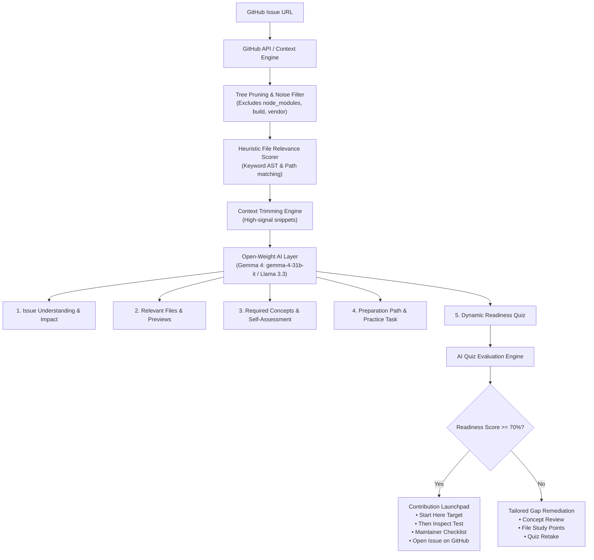

# ContribReady

> **From GitHub Issue to Contribution-Ready.**

[](https://opensource.org/licenses/MIT)
[](https://www.mlh.com/events/react-hyderabad-hack-day/challenges)
[-blue)](https://ai.google.dev/gemma)

ContribReady is an open-source developer readiness platform that analyzes any public GitHub issue together with its codebase using **open-weight AI models** to prepare contributors *before* they start writing code.

---

## The Problem

Many students and beginner/intermediate developers want to contribute to open-source software, but face an intimidating knowledge barrier after finding an interesting GitHub issue.

They frequently struggle with:
- **Understanding maintainer intent:** What is the issue actually asking for in codebase terms?
- **Locating entry points:** Which files and modules in a 10,000-file repository actually need modification?
- **Prerequisite gaps:** Which core programming patterns (e.g., event loop lifetimes, HTTP idempotency, reconciler fibers) are required?
- **Validation anxiety:** How does a contributor know whether they are truly prepared to write code and tests before submitting a PR?

Existing tools summarize repositories or act as generic chatbots, but none bridge the specific gap between:
> **"I found an open-source issue"** and **"I am prepared to solve this issue."**

---

## The Solution

ContribReady accepts a GitHub Issue URL, autonomously extracts the repository structure and high-signal source modules, and leverages open-weight AI as the central intelligence layer to provide:

1. **Plain-English Issue Understanding:** Demystifying technical terminology into clear requirements.
2. **Relevant File Mapping:** Scoring and highlighting priority files with exact reasons and code previews.
3. **Required Concepts & Mini Learning:** Focused lessons on essential programming concepts with interactive self-assessment (`I know this` / `I need to learn this`).
4. **Step-by-Step Preparation Roadmap:** Sequential learning milestones connected directly to repository files.
5. **Interactive Ready Check (Quiz):** 3–5 dynamically generated, repository-specific questions validating the contributor's mental model.
6. **AI Readiness Assessment & Launchpad:** Scoring, tailored review recommendations, maintainer checklist, and direct launch to the original GitHub issue.
7. **Context-Aware Contributor AI:** Live Q&A assistant grounded in the fetched repository code.

---

## Why Open-Weight AI?

Open-weight AI models (such as **Google Gemma 4 (`gemma-4-31b-it`)** and **Meta Llama 3.3**) are central to ContribReady's architecture rather than decorative add-ons. 

- **Code Reasoning Over Generic Chat:** Open-weight models fine-tuned on code excel at structural AST reasoning, file relevance heuristics, and extracting prerequisite concepts from complex codebases.
- **Privacy & Local Autonomy:** By supporting providers like Ollama alongside cloud inference, ContribReady can run completely on-device without leaking proprietary codebase contexts or incurring heavy API costs.
- **Auditable Mentorship:** Open-weight intelligence provides explainable, reproducible preparation paths and issue-specific quizzes tailored directly to the repository's patterns.

---

## Architecture



---

## Core Features

- 🎯 **One-Click GitHub URL Analysis:** Paste any `https://github.com/owner/repo/issues/123` URL. Automatic extraction of metadata, repo description, and discussion comments.
- 🌳 **Intelligent Context Trimming:** Automatically filters out noise (`node_modules`, `.git`, `dist`, lockfiles) and scores repository files by relevance to the issue description.
- 🔍 **Interactive Code Previewer:** Inspect extracted code snippets directly inside the application with line numbers and syntax formatting.
- 💡 **Mini-Learning Mode:** Interactive concept cards with explanations of why each topic matters *for this specific issue*, plus self-assessment tracking.
- 🧪 **Repository-Specific Ready Check:** 3 to 5 realistic multiple-choice questions dynamically generated from the repository's architecture and files.
- 📊 **Readiness Verdict & Launchpad:** Transparent scoring with clear AI-assisted preparation indicators (not a fake certification), maintainer checklists, and immediate GitHub links.
- 💬 **Contributor AI Assistant:** Context-grounded chat drawer answering questions like *"Why is this file relevant?"* and *"What should I test first?"*.
- ⚡ **Safe Hackathon Demo Mode:** Pre-loaded benchmark datasets (Express.js, React, Flask) ensuring zero-failure live presentations even during network drops or GitHub API rate limits.

---

## Tech Stack

| Layer | Technologies |
| --- | --- |
| **Frontend** | React 19, Vite 8, Tailwind CSS v4, Lucide Icons, Canvas Confetti |
| **Backend** | Node.js (v24), Express 4, Axios, Dotenv |
| **AI Intelligence** | Open-Weight Models: Google Gemma 4 (`gemma-4-31b-it`), Meta Llama 3.3 (`llama-3.3-70b-versatile`), Qwen 2.5 Coder |
| **Providers** | Google Gemini API (Gemma 4), Groq, OpenRouter, Ollama (Local) |
| **Data Engine** | GitHub REST API, Recursive Git Trees API, Heuristic Keyword Matcher |

---

## Setup & Installation

### Prerequisites
- Node.js (v18+)
- npm or pnpm

### Quick Start (Full Stack)

1. **Clone the repository:**
   ```bash
   git clone https://github.com/kondl/contribready.git
   cd contribready
   ```

2. **Install all dependencies:**
   ```bash
   npm run install:all
   ```

3. **Configure Environment Variables (Optional):**
   Copy `.env.example` to `backend/.env`:
   ```bash
   cp .env.example backend/.env
   ```
   *Note: If no API key is provided, ContribReady runs in Demo/Benchmark mode with full offline functionality!*

4. **Build the frontend:**
   ```bash
   npm run build
   ```

5. **Start the application:**
   ```bash
   npm start
   ```
   Open [http://localhost:3001](http://localhost:3001) in your browser!

### Development Mode

To run backend and frontend with hot-reloading:
```bash
# Terminal 1: Backend
npm run dev:backend

# Terminal 2: Frontend
npm run dev:frontend
```
Open [http://localhost:5173](http://localhost:5173).

---

## Environment Variables

| Variable | Description | Default |
| --- | --- | --- |
| `PORT` | Backend server port | `3001` |
| `GITHUB_TOKEN` | Optional GitHub Personal Access Token (increases API limit from 60 to 5,000 req/hr) | `None` |
| `AI_PROVIDER` | Inference provider: `gemini`, `groq`, `openrouter`, `ollama`, or `demo` | `gemini` |
| `AI_MODEL` | Open-weight model identifier (target: `gemma-4-31b-it`) | `gemma-4-31b-it` |
| `GEMINI_API_KEY` | Google Gemini API Key for running Gemma 4 | `None` (Falls back to benchmark mode) |
| `OLLAMA_HOST` | Local Ollama host (if `AI_PROVIDER=ollama`) | `http://localhost:11434` |

---

## 2-Minute Hackathon Demo Flow

| Time | Action | What to Highlight |
| --- | --- | --- |
| **0:00 – 0:20** | Open ContribReady homepage | Present the problem: *"Beginners find an issue on GitHub, but don't know if they have the skills or know which files to touch."* |
| **0:20 – 0:40** | Click **"Try Demo"** or paste Express issue `#5482` | Show the multi-stage progress engine gathering git trees, scoring files, and calling the open-weight AI model. |
| **0:40 – 1:10** | Explore **Relevant Files & Concepts** | Show that AI mapped the issue to `lib/router/layer.js` and `test/app.router.js`. Click **Inspect Snippet** to show live code. Click a concept for **Mini Learning Mode**. |
| **1:10 – 1:40** | Take the **Readiness Quiz** | Complete the 4 repository-specific questions. Submit to trigger real-time AI evaluation and celebratory confetti! |
| **1:40 – 2:00** | View **Contribution Launchpad** | Review the *"Start Here"* file guidance, maintainer checklist, and click **"Open Issue on GitHub"** to show the complete end-to-end journey! |

---

## License

This project is licensed under the [MIT License](LICENSE) — see the LICENSE file for details.
