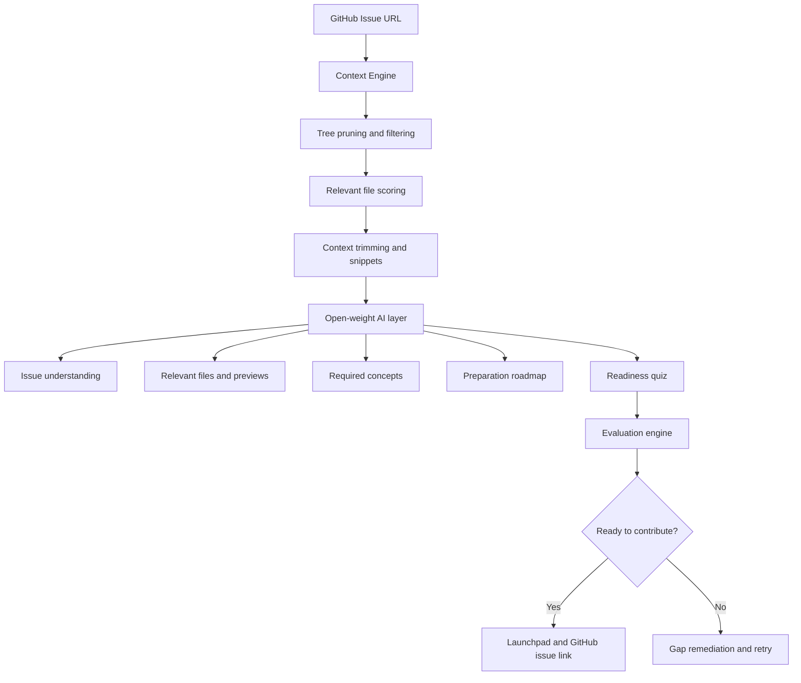

# ContribReady

<p align="center">
  
  
  
  
</p>

> From GitHub Issue to Contribution-Ready.

ContribReady is an AI-powered open-source readiness platform that helps developers understand a GitHub issue, find the most relevant files, learn the required concepts, and evaluate whether they are prepared to contribute confidently before opening a pull request.

Whether you are a student, beginner contributor, or experienced developer exploring a new codebase, ContribReady turns a vague GitHub issue into a structured preparation workflow.

---

## Why this project exists

Many contributors struggle not because they lack motivation, but because they do not know:

- what the issue is actually asking for
- which files in a large repo matter most
- which concepts are required before making a meaningful contribution
- whether they are ready to begin implementing a fix

ContribReady bridges that gap by combining:
- GitHub issue and repository context extraction
- intelligent file relevance scoring
- concept-driven learning
- guided readiness checks
- contributor-focused launch guidance

---

## Key features

- GitHub issue URL analysis
- Automatic repository context gathering
- Relevant file prioritization and snippets
- Issue understanding in plain English
- Concept cards and prerequisite guidance
- Step-by-step contribution readiness roadmap
- AI-generated readiness quiz
- Contributor support assistant grounded in repo code
- Open-weight AI integration with local or cloud providers
- Demo-safe benchmark mode for hackathons and live presentations

---

## Architecture



---

## Tech stack

| Layer | Stack |
| --- | --- |
| Frontend | React 19, Vite, Tailwind CSS |
| Backend | Node.js, Express |
| AI Integration | Google Gemini, Groq, OpenRouter, Ollama, demo mode |
| Data Sources | GitHub REST API, repository tree analysis |
| UI Utilities | Lucide Icons, Canvas Confetti |

---

## Repository structure

```text
.
├── backend/              # Express backend
├── frontend/             # React + Vite frontend
├── challenges/           # Hackathon challenge docs
├── docs/                 # Submission and project documentation
├── submissions/          # Project submission templates/files
├── .env.example          # Example environment configuration
├── .gitignore
├── CODE_OF_CONDUCT.md
├── CONTRIBUTING.md
├── EVENT_README.md
├── HACK-DAY-CRASH-COURSE.md
├── LICENSE
├── PRE-EVENT-PREP.md
├── PROBLEM_STATEMENTS.md
├── README.md
├── render.yaml
├── SECURITY.md
├── SUBMISSION_TEMPLATE.md
├── package.json
└── ...
```

---

## Getting started

### Prerequisites

- Node.js 20 or newer
- npm
- Optional: GitHub token
- Optional: Gemini / Groq / OpenRouter / Ollama credentials

### 1) Clone the repository

```bash
git clone https://github.com/ysathyasai/hacktoberfest-hack-day-2026.git
cd hacktoberfest-hack-day-2026
```

### 2) Install dependencies

```bash
npm run install:all
```

This installs dependencies for both the backend and frontend.

### 3) Configure environment variables

Copy the environment template:

```bash
cp .env.example backend/.env
```

Update the values as needed.

### 4) Run the app

#### Development mode

```bash
npm run dev:backend
npm run dev:frontend
```

The backend runs on:

- `http://localhost:3001`

The frontend runs on:

- `http://localhost:5173`

#### Production-style build

```bash
npm run build
npm start
```

---

## Environment variables

| Variable | Description | Default |
| --- | --- | --- |
| `PORT` | Backend port | `3001` |
| `GITHUB_TOKEN` | GitHub token for increased API capacity | optional |
| `AI_PROVIDER` | Model provider (`gemini`, `groq`, `openrouter`, `ollama`, `demo`) | `gemini` |
| `AI_MODEL` | Model name / identifier | `gemma-4-31b-it` |
| `GEMINI_API_KEY` | API key for Gemini-based models | optional |
| `OLLAMA_HOST` | Local Ollama endpoint | `http://localhost:11434` |

---

## Available scripts

From the root `package.json`:

```bash
npm run install:all   # install frontend + backend deps
npm run build         # build frontend
npm run start         # start backend
npm run dev:backend   # run backend in watch mode
npm run dev:frontend  # run frontend in live dev mode
```

---

## Demo workflow

A typical live demo flow:

1. Open the app in the browser
2. Paste a public GitHub issue URL
3. Allow the app to fetch repository context
4. Review relevant files, snippets, and issue summary
5. Explore required concepts and mini-lessons
6. Answer the repository-specific readiness quiz
7. Review the AI assessment and launchpad recommendations

This workflow helps developers understand whether they are actually ready to start contributing.

---

## Contributing

Contributions are welcome.

1. Fork the repository
2. Create a feature branch
3. Make your changes
4. Run validation/build checks
5. Submit a pull request

For more details, see [CONTRIBUTING.md](CONTRIBUTING.md).

---

## Code of conduct

Please review our community expectations in [CODE_OF_CONDUCT.md](CODE_OF_CONDUCT.md).

---

## Security

If you discover a security vulnerability, please report it responsibly via the project’s security process. See [SECURITY.md](SECURITY.md).

---

## License

This project is licensed under the [MIT License](LICENSE).

---

## Project status

This repository combines a working app prototype with event and submission materials for the Hacktoberfest Hack Day 2026 context. The core product is the ContribReady platform and the project is designed to be extensible for further development, demoing, and community contributions.

---

## Acknowledgements

- Open-weight AI models
- GitHub API ecosystem
- React and Vite communities
- Hacktoberfest and MLH community initiatives
